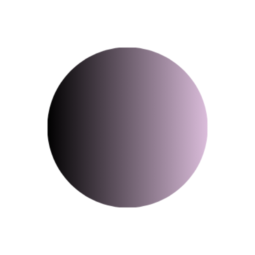

# Casys AI

**Independent R&D studio — open source first**

MCP servers that connect AI agents to the systems holding engineering and
business data: SysML models, CAD, FEA, simulation, ERP, e-invoicing. Plus the
extraction toolkits that get data out of platforms with no API.
TypeScript and Deno, MIT.

<a href="https://casys.ai">casys.ai</a> ·
<a href="https://www.linkedin.com/showcase/casys-ai">LinkedIn</a> ·
<a href="mailto:hello@casys.ai">hello@casys.ai</a> ·
Taiwan

 
 

---

Status column: **Active** means it moves week to week, **Stable** that it works
and gets touched when a dependency moves, **Paused** that nothing is planned.
The badge below each one is the last commit, straight from GitHub.

## Engineering chain

Model-to-physics tooling: a SysML model, CAD geometry, a mesh and a solve, a
constraint checked against the result. Each server runs standalone.

| Repository | Scope | Status |
| --- | --- | --- |
| [mcp-syson](https://github.com/Casys-AI/mcp-syson) | SysML v2 MBSE through SysON — 29 tools, AQL queries, requirements tracing, 4 UI viewers, docker-compose included. | **Active**  |
| [mcp-build123d](https://github.com/Casys-AI/mcp-build123d) | Parametric CAD as code (Python/OCCT) — exact mass properties, STEP/STL/GLTF export. | **Active**  |
| [mcp-calculix](https://github.com/Casys-AI/mcp-calculix) | FEA — Gmsh meshing plus CalculiX linear static solve on STEP files. Faces designated by bounding box, mm/N/MPa. | **Active**  |
| [mcp-modelica](https://github.com/Casys-AI/mcp-modelica) | OpenModelica system-level multiphysics simulation, reproducible runs. | **Active**  |
| [mcp-onshape](https://github.com/Casys-AI/mcp-onshape) | Onshape CAD/PDM — 100 tools across 14 categories, 4 UI viewers. | **Active**  |
| [constraint-solver](https://github.com/Casys-AI/constraint-solver) | Parametric constraints with units treated as part of the value — 2.5 kg against a 4 lb limit fails. Satisfiability and optimisation through z3. Source-agnostic: SysML, FEA, cost models. | **Active**  |

## Business systems

| Repository | Scope | Status |
| --- | --- | --- |
| [mcp-erpnext](https://github.com/Casys-AI/mcp-erpnext) | ERPNext / Frappe — 120 tools across 14 categories, 7 interactive UI viewers. | **Active**  |
| [mcp-einvoice](https://github.com/Casys-AI/mcp-einvoice) | French e-invoicing — CII / UBL / Factur-X, PA-agnostic adapter pattern. | **Stable**  |

## Framework

| Repository | Scope | Status |
| --- | --- | --- |
| [mcp-server](https://github.com/Casys-AI/mcp-server) | Casys MCP Platform — middleware pipeline, OAuth2, concurrency control, backpressure, observability, interactive UIs. Published on JSR and npm. | **Active**  |

## Extraction toolkits

| Repository | Scope | Status |
| --- | --- | --- |
| [ecommerce-platform-scraper](https://github.com/Casys-AI/ecommerce-platform-scraper) | Deno scraping toolkit for e-commerce storefronts, organised by platform — SHOPLINE / Cyberbiz / BV SHOP adapters, multimodal LLM + OCR extraction. Domain-agnostic. | **Active**  |
| [formation-platform-scraper](https://github.com/Casys-AI/formation-platform-scraper) | Teachizy-hosted course platforms — dual auth, content extraction, Whisper transcription, link qualification, pedagogical knowledge graph. Playwright driven in-process, nothing tenant-hardcoded. | **Active**  |

## Side project

| Repository | Scope | Status |
| --- | --- | --- |
| [DenoClaw](https://github.com/Casys-AI/DenoClaw) | Deno-native AI agent framework — Subhosting + Sandbox + A2A protocol, zero Node.js deps. | **Paused**  |

---

MIT unless the repository states otherwise · <a href="mailto:hello@casys.ai">hello@casys.ai</a>

